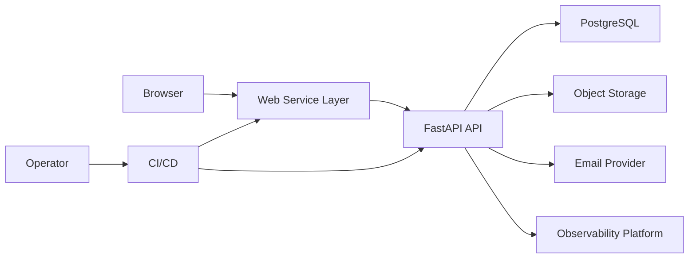

# SYS-002 System Context

## Actors

| Actor | Interaction |
|---|---|
| Visitor | Browses public content, searches, downloads public attachments, submits inquiries |
| Member | Authenticates, manages bookmarks, views inquiry history, updates account state where allowed |
| Administrator | Manages CMS entities, users, inquiries, attachments, and audit review |
| Operator | Configures environments, deploys releases, monitors health, restores service, responds to incidents |
| Email recipient | Receives reset and notification messages |

## External Systems

| External system | Relationship |
|---|---|
| Browser | Runs the React application and stores short-lived client session material according to security policy |
| PostgreSQL | Stores relational data, sessions, audit records, and file metadata |
| Object storage | Stores uploaded file bytes with lifecycle and access controls |
| Email provider | Sends transactional email and returns delivery status |
| Observability platform | Receives structured logs, metrics, traces or correlation records, and alert events |
| CI/CD platform | Runs quality gates, builds artifacts, executes deployment, and records release evidence |

## Trust Boundaries

## Boundary Rules

- Browser input is untrusted.
- Bearer tokens and reset tokens are secrets.
- Administrative privileges are validated by the API for every privileged operation.
- Object storage access is mediated through application authorization or signed access policy.
- Logs and metrics exclude raw secrets and unnecessary personal data.
