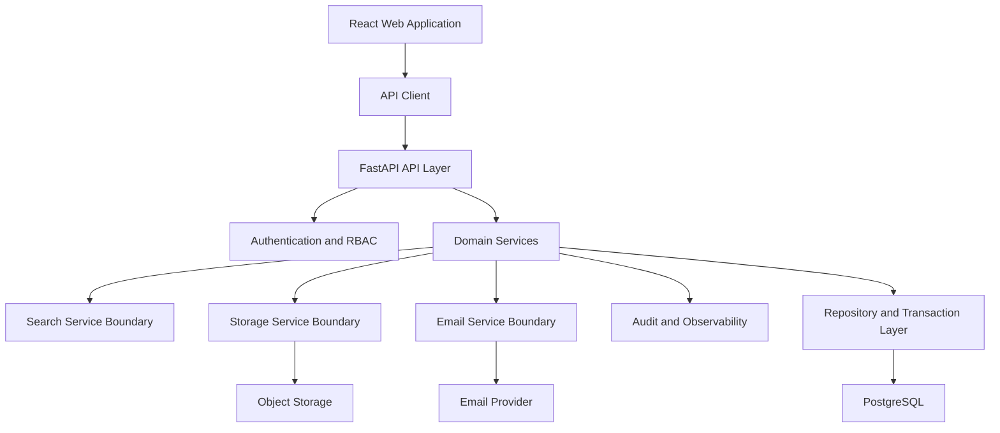

# SYS-003 Logical Architecture

## Layered View

## Logical Responsibilities

| Layer | Responsibility |
|---|---|
| Presentation | Route users through public, member, and administrator workflows |
| API | Validate requests, enforce authentication and authorization, expose versioned contracts |
| Domain services | Apply business rules for content, inquiries, accounts, files, and search |
| Integration services | Encapsulate object storage, email, and observability providers |
| Data layer | Manage transactions, constraints, migrations, and query consistency |

## Cross-Cutting Concerns

Cross-cutting concerns include correlation ID propagation, structured logging, audit logging, metrics, error normalization, UTC timestamps, secret management, privacy limits, and authorization checks.

## Dependency Rule

Higher layers call lower-level service interfaces. Provider-specific code remains behind adapters. Database models do not contain browser or provider concerns.
