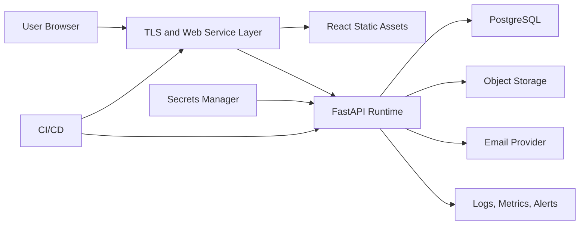

# SYS-005 Deployment Architecture

## Environments

| Environment | Purpose |
|---|---|
| Local development | Developer workflow with reproducible service dependencies |
| Verification | Automated gates with production-like service wiring |
| Staging | Release candidate validation with managed services or faithful substitutes |
| Production | User-facing runtime with managed secrets, backups, monitoring, and controlled deployment |

## Production Topology

## Deployment Flow

1. Build frontend and backend artifacts from reviewed source.
2. Run static, unit, integration, security, and contract quality gates.
3. Apply database migrations before traffic reaches incompatible application code.
4. Deploy API with controlled rollout.
5. Deploy web assets with immutable cache policy.
6. Run smoke checks and readiness checks.
7. Keep rollback path available until acceptance gates pass.

## Health And Readiness

Liveness confirms process health. Readiness confirms database connectivity, migration compatibility, object storage reachability, and any required provider checks that are safe to run frequently.

## Secrets

Secrets are supplied by a secrets manager or equivalent protected facility. Secrets are not embedded in images, documentation examples, or client bundles.
