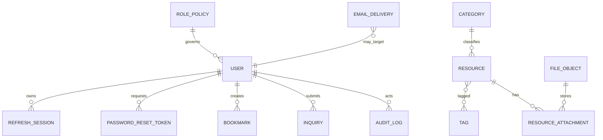

# ICD-002 Database Interface

## Data Model

## Entity Definitions

| Entity | Identifier | Key attributes | Constraints and indexes | Lifecycle and privacy |
|---|---|---|---|---|
| User | UUID | email, name, password hash, role, active state | unique email, role index | Personal data, audited for admin changes |
| RolePolicy | stable key | role, permissions | unique role | Defines RBAC policy |
| RefreshSession | UUID | user, token digest, expiry, revoked time, replay marker | unique token digest, user and expiry indexes | Security data, retained by policy |
| PasswordResetToken | UUID | user, token digest, expiry, used time | unique token digest, expiry index | Security data, short retention |
| Category | UUID | name, slug, description, active state | unique name and slug | Classification record |
| Tag | UUID | name, slug, active state | unique name and slug | Classification record |
| Resource | UUID | title, summary, body, audience, type, status, published time | status, category, published, search indexes | Content lifecycle with audit |
| ResourceAttachment | UUID | resource, file object, display name, order | resource index | Attachment association |
| Notice | UUID | title, body, status, published time | status and published indexes | Content lifecycle |
| Article | UUID | title, summary, body, status, published time | status and published indexes | Content lifecycle |
| FAQ | UUID | question, answer, order, status | order and status indexes | Content lifecycle |
| Inquiry | UUID | user, email, subject, message, status, assigned admin, notes | status, user, email indexes | Personal data with retention |
| Bookmark | UUID | user, resource | unique user/resource | Personal preference data |
| AuditLog | UUID | actor, action, entity, detail, correlation ID, timestamp | action, entity, timestamp indexes | Retained for accountability |
| FileObject | UUID | object key, checksum, MIME, size, scan state, retention state | object key and checksum indexes | Metadata for object storage |
| EmailDelivery | UUID | template, recipient, status, provider id, retry count | status and recipient indexes | Personal data and delivery evidence |

## Detailed Entity Contract

| Entity | Primary key | Nullability and foreign keys | Cardinality | Indexes | State and deletion | Privacy and audit | Retention and transaction boundary |
|---|---|---|---|---|---|---|---|
| User | UUID | email, name, password hash, role, active are required; role references RolePolicy | One user has many sessions, reset tokens, bookmarks, inquiries, audit actions | email unique, role, active | disabled by state; hard delete only through privacy workflow | personal data; admin changes audited | retained by account policy; account writes in one transaction |
| RolePolicy | stable key | role and permission set required | One role governs many users | role unique | changed by controlled admin policy | not personal; changes audited | retained as configuration history |
| RefreshSession | UUID | user FK required; digest, expiry required; revoked and replay fields nullable | Many sessions per user | digest unique, user, expiry, revoked | active, revoked, expired, replay-handled | security data; replay audited | retained by session policy; rotation atomic |
| PasswordResetToken | UUID | user FK required; digest and expiry required; used time nullable | Many reset tokens per user | digest unique, expiry, user | active, used, expired | security data; reset events audited | short retention; confirm transaction changes password and token state |
| Category | UUID | name and slug required | One category classifies many resources | name unique, slug unique, active | active or inactive; hard delete only when unreferenced | not personal; admin changes audited | retained while referenced; CMS write transaction |
| Tag | UUID | name and slug required | Many tags classify many resources | name unique, slug unique, active | active or inactive; hard delete only when unreferenced | not personal; admin changes audited | retained while referenced; CMS write transaction |
| Resource | UUID | category FK required; title, summary, body, audience, type, status required | One resource has many attachments and tags | status, category, published time, search fields | draft, published, archived; soft delete by archive | content record; admin changes audited | retained by content policy; CMS write transaction |
| ResourceAttachment | UUID | resource FK and file object FK required; display name required | Many attachments per resource; one attachment points to one FileObject | resource, file object, display order | active, detached, deleted | metadata may expose filename; changes audited | follows resource/file retention; metadata transaction plus storage compensation |
| Notice | UUID | title, body, status required | Independent content item | status, published time | draft, published, archived | content record; changes audited | retained by content policy; CMS write transaction |
| Article | UUID | title, summary, body, status required | Independent content item | status, published time, search fields | draft, published, archived | content record; changes audited | retained by content policy; CMS write transaction |
| FAQ | UUID | question, answer, order, status required | Independent support item | status, order, search fields | draft, published, archived | content record; changes audited | retained by content policy; CMS write transaction |
| Inquiry | UUID | email, subject, message, consent, status required; user FK nullable | User may have many inquiries; visitor inquiry has no user FK | status, user, email, created time | received, in-progress, resolved, closed | personal data; admin handling audited | retained by privacy policy; inquiry update transaction |
| Bookmark | UUID | user FK and resource FK required | User-resource many-to-many through bookmark | user/resource unique | hard delete allowed by member action | personal preference; not public | retained while active; create/delete idempotent transaction |
| AuditLog | UUID | actor FK nullable for system events; action, target, timestamp required | Actor may have many audit records; target is polymorphic | action, target, actor, timestamp, correlation ID | append-only | may reference personal actor; protected access | retained by audit policy; written with privileged transaction |
| FileObject | UUID | object key, size, checksum, MIME, scan state required | One file object may back one or more attachment records by policy | object key unique, checksum, scan state | pending, available, quarantined, deleted | filename metadata may be personal; file actions audited | retained by file policy; object operation plus reconciliation |
| EmailDelivery | UUID | template, recipient, status required; related entity nullable | Many deliveries may relate to user, reset token, inquiry, or operational event | status, recipient, provider id, created time | queued, sent, retrying, delivered, bounced, failed | recipient is personal data; delivery events audited where security-sensitive | retained by email policy; outbox transaction then provider send |

All entities include created-at and updated-at UTC timestamps unless explicitly append-only. Append-only audit records include created-at only. Nullable fields must be intentional and documented by the owning CDD or ICD.
## UTC Policy

All persisted timestamps use timezone-aware UTC. API serialization uses ISO 8601 UTC. Date comparisons are made after UTC normalization.

## Transaction Boundaries

| Operation | Boundary |
|---|---|
| CMS write | Entity mutation and audit record in one transaction |
| Refresh rotation | Old session revocation and new session creation in one transaction |
| Password reset confirm | Token use, password change, session revocation, and audit event in one transaction where feasible |
| Bookmark create/delete | Unique record mutation in one transaction |
| File upload | Metadata transaction plus object-storage compensation |
| Email send | Delivery record plus provider call through outbox or retryable state |

## Security Considerations

Raw passwords, raw refresh tokens, raw reset tokens, and provider secrets are never stored. Personal data columns follow retention and access policy. Backups are encrypted.

## Observability

Database metrics include connection use, query latency, lock waits, migration status, replication lag where used, and backup status.
