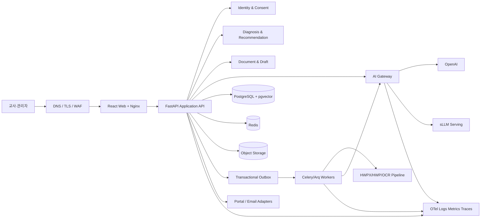

# 03. 시스템 아키텍처와 CDD/CDR

문서 ID: ARCH-CDR-003  
아키텍처 스타일: Modular service + asynchronous worker + provider adapter

## 1. 논리 구성도

외부 AI에는 AI Gateway만 연결할 수 있다. 원본 문서와 개인정보 저장소는 public network에 노출하지 않는다. 관리자 콘솔은 동일 API를 사용하되 MFA, 재인증, 세분화 권한을 추가한다.

## 2. 배포 구성

| 환경 | 목적 | 구성 |
|---|---|---|
| local | 개발·단위·E2E | Docker Compose, provider stub, synthetic data |
| test | CI 통합 | ephemeral PostgreSQL/Redis/Object Storage, mock AI |
| stage | 운영 유사 검증 | production topology 축소, 비식별 평가셋 |
| production | 실제 서비스 | TLS/WAF, app·worker scale-out, managed/HA DB, off-host backup |

서비스 이미지는 immutable digest로 배포한다. migration은 별도 one-shot job으로 실행하며 성공 전 application rollout을 허용하지 않는다. API와 worker는 독립 확장하고, GPU sLLM serving은 별도 node pool 또는 내부 endpoint로 격리한다.

## 3. CDD: 컴포넌트 상세

| ID | 컴포넌트 | 책임 | 입력/출력 | 실패·확장 |
|---|---|---|---|---|
| CDD-001 | Web Portal | 역할별 IA, 접근성, API/SSE client | REST, SSE, signed URL | 오류경계·재연결; stateless CDN 확장 |
| CDD-002 | Application API | 요청 검증, use case, transaction, policy | `/api/v1`, outbox event | timeout·idempotency; horizontal scale |
| CDD-003 | Identity & Consent | OIDC/local auth, session rotation, RBAC/ABAC, 동의 | JWT, session, policy decision | replay 차단, MFA; DB 일관성 우선 |
| CDD-004 | Diagnosis Engine | 세션 상태, 질문정책, evidence, deterministic scoring | turn/evidence/rubric/result | AI fallback·재개; 세션별 lock |
| CDD-005 | Recommendation Engine | hard filter, rank, diversity, path graph | score/persona/catalog → recommendation | 이전 승인정책 fallback; batch 평가 |
| CDD-006 | Document Service | 파일·권리·버전·ACL·게시 수명주기 | file metadata, signed URL | quarantine; object storage scale |
| CDD-007 | Document Worker | 변환, OCR, DocumentGraph, chunk, embedding | job/event → artifact/index | retry/dead-letter; queue별 autoscale |
| CDD-008 | Retrieval & Draft | ACL-first retrieval, citation, HWPX draft | query/evidence/template | no-answer; read replica/index scale |
| CDD-009 | AI Gateway | model registry, routing, redaction, schema, fallback | canonical AI request/response | circuit breaker, quota; provider pool |
| CDD-010 | Reporting & Pilot | snapshot, 집계, cohort, 설문·FGI | versioned fact → report | 재계산 job; privacy threshold |
| CDD-011 | Audit & Observability | 감사, trace, metric, SLO, cost ledger | event/span/metric | buffer·backpressure; 독립 보관 |
| CDD-012 | Integration Adapters | 포털, 교육과정, email, HWP 변환 | canonical contract ↔ external | contract test·outbox retry |

### 3.1 공통 컴포넌트 계약

- 모든 command는 `request_id`, `actor`, `tenant_id`, `schema_version`, `occurred_at`을 가진다.
- 외부 side effect는 DB transaction과 outbox 기록 후 비동기로 수행한다.
- API에서 provider SDK와 파일 parser를 직접 호출하지 않는다.
- domain object는 provider 명칭이 아닌 canonical type을 사용한다.
- retry는 idempotent operation만 대상으로 exponential backoff+jitter를 적용한다.
- dead-letter는 자동 폐기하지 않고 원인·재처리·승인 이력을 보존한다.

## 4. 핵심 실행 흐름

### 4.1 진단 턴

`POST turn → 권한·동의 확인 → 입력 최소화/위험검사 → AI Gateway evidence extraction → schema 검증 → evidence 저장 → deterministic score → next-question policy → transaction commit → 응답/SSE`

AI timeout이면 입력과 상태를 보존하고 정형 질문 또는 재시도 선택을 제공한다. schema validation 실패는 최대 1회 repair를 허용하고 이후 안전한 fallback을 사용한다.

### 4.2 문서 수집

`signed upload → checksum/악성검사 → SourceDocumentVersion 생성 → outbox → parser/OCR → DocumentGraph → quality gate → human review → chunk/embed → index snapshot → publish`

게시 전 artifact는 검색 결과에 노출되지 않는다. 재처리는 새 artifact version을 만들며 게시 snapshot은 불변이다.

### 4.3 RAG 답변

`query policy → tenant/ACL filter → lexical+vector retrieval → RRF → rerank → evidence budget → generation → claim-citation validation → response`

검증되지 않은 claim은 제거하거나 no-answer로 전환한다. answer, citation, model/prompt/index version과 latency/cost를 한 실행 레코드로 묶는다.

## 5. Trust boundary

| 경계 | 통제 |
|---|---|
| Browser ↔ Edge | TLS, CSP, CSRF, rate limit, bot/abuse control |
| Edge ↔ API | private network, proxy header allowlist, request size 제한 |
| API ↔ Data | service identity, least privilege, encryption, query policy |
| Worker ↔ Uploaded file | quarantine, no network parser sandbox, CPU/memory/time 제한 |
| AI Gateway ↔ External AI | data classification, redaction, egress allowlist, audit |
| Admin ↔ Control plane | MFA, reauthentication, dual approval, immutable audit |
| HWP conversion worker | Windows 격리, macro 금지, one-way artifact exchange |

## 6. CDR: 주요 설계 결정

| CDR | 결정 | 근거 | 결과·제약 |
|---|---|---|---|
| CDR-001 | YOnLab 독립 플랫폼과 포털 adapter | 외부 포털 변경·권리·운영 의존 축소 | 공개 계약 외 직접 결합 금지 |
| CDR-002 | React+TypeScript, FastAPI | 접근성 UI와 typed API, AI 생태계 | OpenAPI client 자동생성 |
| CDR-003 | PostgreSQL+pgvector | transaction metadata와 초기 vector 운영 단순화 | 규모 임계치 초과 시 vector adapter 전환 |
| CDR-004 | Redis+비동기 worker | OCR·embedding·report 장기작업 분리 | 202+Job, idempotency 필수 |
| CDR-005 | OpenAI+sLLM Hybrid Gateway | 품질·비용·데이터 통제 균형 | task/data별 routing, provider lock-in 금지 |
| CDR-006 | LLM은 evidence 추출, 점수는 결정적 계산 | 재현성·설명가능성·감사 | rubric version과 evidence 필요 |
| CDR-007 | 페르소나는 확률분포와 사용자 수정 | 낙인·오분류 위험 완화 | 인사평가에 사용 금지 |
| CDR-008 | HWPX를 canonical 생성 형식 | XML 구조·검증·자동화 용이 | HWP는 격리 변환으로만 제공 |
| CDR-009 | DocumentGraph와 계층형 chunk | 표·서식·citation 위치 보존 | parser별 canonical mapping 필요 |
| CDR-010 | ACL-first hybrid RAG | 정보유출 방지와 검색 품질 | post-filter만 사용하는 구현 금지 |
| CDR-011 | Transactional outbox | DB 상태와 외부 side effect 일관성 | consumer idempotency 필요 |
| CDR-012 | Evidence-first AI 평가 gate | 회귀를 배포 전에 차단 | versioned golden set 유지 |
| CDR-013 | Observability와 audit 분리 | 운영 telemetry와 법적 감사 목적 차이 | 감사 로그 별도 보존·권한 |
| CDR-014 | 개발용 호환 proxy는 production data plane에서 제외 | inbound auth·quota·감사 부족 위험 | 제한된 offline adapter만 허용 |

## 7. 검색·AI 확장 임계치

- pgvector p95가 승인 목표를 3회 연속 위반하거나 active vector가 3천만 건을 넘으면 전용 vector store를 비교 평가한다.
- sLLM은 평가 hard gate를 통과한 task에서만 활성화하고 GPU queue p95·실패율·비용을 routing에 반영한다.
- Object Storage와 Email은 adapter contract를 고정하고 사업자 결정은 환경 구성으로 제한한다.
- production topology 변경은 성능, 복구, 보안, 비용 증거를 첨부한 CDR 승인 대상이다.

## 8. 아키텍처 수용 기준

1. provider·storage·email·portal을 contract test로 대체할 수 있다.
2. 외부 AI egress가 AI Gateway를 우회하지 않는다.
3. API 중단 없이 worker와 AI serving을 독립 확장할 수 있다.
4. 문서·진단 실행을 version 정보로 재현할 수 있다.
5. 장애 시 핵심 포털·기존 보고서·검색은 정의된 degraded mode로 제공된다.

