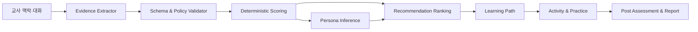

# 04. AI 역량진단·페르소나·추천 설계

문서 ID: AI-DIAG-004  
안전 원칙: 교육 지원 도구이며 의료·심리 진단과 인사평가에 사용하지 않는다.

## 1. 모듈 경계



LLM은 발화의 의미, 근거 구간, 후보 역량, 추가 질문 후보를 구조화한다. 점수 산정, 수준 판정, 추천 hard filter, 통계 집계는 versioned rule과 코드로 결정한다.

## 2. 역량체계

| 코드 | 역량 | 관찰 항목 예시 |
|---|---|---|
| COMP-01 | 누리과정·보육과정 실행 | 목표-놀이-평가 연계, 유연한 계획 |
| COMP-02 | 영유아 발달 이해 | 발달차 존중, 관찰 기반 지원 |
| COMP-03 | 교사-영유아 상호작용 | 민감성, 질문, 갈등 중재, 포용 |
| COMP-04 | 관찰·기록·평가 | 객관적 기록, 해석 구분, 환류 |
| COMP-05 | 가정·지역사회 연계 | 보호자 소통, 자원 연계, 개인정보 |
| COMP-06 | 안전·권리·윤리 | 안전, 아동권리, 신고·윤리 경계 |
| COMP-07 | 전문성·학습운영 | 성찰, 협업, 디지털 활용, 지속학습 |

각 역량은 4수준 rubric을 가진다: `L1 기초 인식`, `L2 부분 적용`, `L3 일관 적용`, `L4 상황 확장`. RubricVersion에는 행동 anchor, 반례, 최소 evidence 수, confidence 규칙, 전문가 승인자가 포함된다.

## 3. 대화진단 상태기계

```text
CREATED → CONSENTED → CONTEXT_CAPTURE → ACTIVE
ACTIVE → PAUSED → ACTIVE
ACTIVE → EVIDENCE_REVIEW → SCORED → PERSONA_REVIEW
PERSONA_REVIEW → RECOMMENDED → COMPLETED
어느 상태에서든 사용자는 WITHDRAWN 가능
오류는 RECOVERABLE_ERROR 또는 TERMINATED로 분리
```

### 3.1 질문 정책

1. 안전·동의와 최소 맥락을 먼저 확인한다.
2. 질문별 목표 역량과 예상 information gain을 기록한다.
3. 미충족 역량, 낮은 confidence, 상충 evidence를 우선한다.
4. 자유응답, 상황선택, 성찰 질문을 섞되 한 질문에 한 판단만 요구한다.
5. 동일 의미 반복, 유도 질문, 감정 압박, 민감정보 요구를 금지한다.
6. 최대 18개 핵심 질문 또는 25분을 기본 한도로 하고 교사가 중단·재개할 수 있다.
7. 심각한 위해·학대 신호는 점수에 사용하지 않고 승인된 안전 안내와 사람 지원 경로로 전환한다.

### 3.2 Evidence schema

```json
{
  "turn_id": "uuid",
  "competency_code": "COMP-04",
  "indicator_code": "COMP-04-I02",
  "quoted_span": "개인정보를 제거한 최소 발화 구간",
  "stance": "supports|contradicts|uncertain",
  "strength": 0.0,
  "extractor_confidence": 0.0,
  "context_factors": ["returning_from_leave"],
  "needs_clarification": false,
  "schema_version": "evidence.v1"
}
```

`quoted_span`은 원문 전체 복제가 아니라 판단에 필요한 최소 구간이며, 교사가 결과 화면에서 포함·제외·정정할 수 있다.

## 4. 결정적 scoring

지표 `i`의 정규화 evidence 값을 다음과 같이 계산한다.

```text
e_i = clamp(Σ(sign × strength × extractor_confidence × source_weight) / Σweight, -1, 1)
coverage_d = min(valid_evidence_count / required_evidence_count, 1)
raw_d = Σ(indicator_weight_i × transform(e_i)) / Σindicator_weight_i
confidence_d = coverage_d × agreement_factor × recency_factor
score_d = round(100 × raw_d, 1)
```

- 동일 EvidenceSet, RubricVersion, ScoringPolicyVersion은 항상 같은 결과를 낸다.
- confidence가 0.60 미만이면 확정 level 대신 `추가 확인 필요`로 표시한다.
- 상충 evidence가 임계치를 넘으면 추가 질문 또는 전문가 검토로 보낸다.
- 전체 점수는 역량별 점수를 숨기는 단일 순위값으로 사용하지 않는다.
- 재산정은 이전 snapshot을 덮어쓰지 않고 새 DiagnosisResultVersion을 만든다.

## 5. 대표 교사 페르소나

페르소나는 교사를 고정 분류하는 신분값이 아니라 질문·설명·추천 맥락을 조정하는 확률분포다.

| ID | 명칭 | 주요 맥락 | 지원 방식 |
|---|---|---|---|
| P-01 | 의욕적인 초임 실행가 | 낮은 연차, 높은 시도 의지, 경험 부족 | 짧은 기초+즉시 적용, mentor 사례 |
| P-02 | 신중한 적응형 교사 | 불확실성 높음, 확인 선호 | 작은 단계, 예시·체크리스트, 확신 강요 금지 |
| P-03 | 휴직 후 복귀 재정비형 | 경력 공백, 제도·도구 변화 부담 | 변화 요약, 복귀 경로, 기존 전문성 인정 |
| P-04 | 숙련 실천 개선가 | 풍부한 경험, 고급 문제 해결 | 심화 사례, peer coaching, 성찰·연구 |
| P-05 | 업무과부하 지원 필요형 | 시간 제약, 정서 부담 표현 | 저부담 경로, 우선순위, 사람 지원 안내 |
| P-06 | 지역·소규모 자원제약형 | 접근 가능한 연수·동료·장비 제한 | 비동기·저대역폭, 지역 자원, 대안 자료 |

`P-05`는 질환이나 번아웃을 진단하지 않는다. 지역·연차·기관 규모는 단독으로 역량 점수를 낮추지 않는다.

### 5.1 추론·수정

- 입력 feature: 명시적 프로필, 대화 evidence, 학습 제약, 선호; 보호속성의 부당한 proxy는 제외한다.
- 출력: 상위 3개 `persona_id`, probability, supporting factors, contradicting factors, version.
- 합계는 1이며 최대확률이 0.45 미만이면 `혼합/미확정`으로 표시한다.
- 사용자는 `맞음`, `일부 다름`, `사용하지 않음`을 선택하고 맥락을 수정할 수 있다.
- 수정은 점수를 직접 바꾸지 않고 질문정책과 추천 context를 재계산한다.

## 6. 추천 엔진

### 6.1 후보 생성과 hard filter

연수·자료는 역량, 수준, 소요시간, 형식, 선행조건, 접근성, 지역·온라인 제공, 권리, 게시상태를 가진다. 게시되지 않았거나 권한이 없고, 선행조건을 충족하지 못하며, 시간·접근성 제약과 충돌하는 항목은 ranking 전에 제거한다.

### 6.2 순위식

```text
rank = 0.35 competency_gap
     + 0.20 level_fit
     + 0.15 context_fit
     + 0.10 preference_fit
     + 0.10 evidence_quality
     + 0.10 content_quality
     - overload_penalty
     - redundancy_penalty
```

가중치는 RecommendationPolicyVersion으로 관리한다. 최종 목록은 같은 공급자·형식·역량에 과도하게 쏠리지 않도록 diversity constraint를 적용한다. 행동 로그만으로 중요 교육 내용을 숨기는 협업필터링은 사용하지 않는다.

### 6.3 설명

추천 카드에는 `보완할 역량`, `추천 사유`, `난이도`, `소요시간`, `기대 결과`, `사용한 맥락`, `대안`, `추천하지 않기`를 표시한다. 설명은 ranking feature에서 결정적으로 생성하고 LLM은 읽기 쉬운 표현으로만 변환한다.

## 7. 학습경로·성과 연계

학습경로는 DAG로 표현한다.

- 기초: 개념·안전·핵심 사례
- 심화: 비교 사례·판단·협업
- 적용: 현장 실천과제·관찰·성찰
- 확인: 사후 질문·evidence·교사 자기평가

Step은 선행조건, 선택/필수, 예상시간, 완료규칙, 대체항목을 가진다. 결과 리포트는 사전·사후의 동일 RubricVersion 비교를 우선하며, version이 다르면 변환 규칙과 한계를 표시한다. 기관 보고는 승인된 최소 인원 미만의 집단을 숨기고 개인 순위를 제공하지 않는다.

## 8. 평가와 공정성

| 평가 | 기준 |
|---|---|
| evidence 추출 | span precision/recall, schema 성공률 ≥99.5% |
| 진단 | 전문가 일치도 ≥0.80, test-retest 안정성 |
| 추천 | 전문가·교사 적합도 ≥85%, coverage·diversity |
| 페르소나 | calibration, 사용자의 수정률, 집단별 오차 차이 |
| 안전 | 의료·인사 판단 금지 위반 0건, 위해 대응 정확성 |
| 설명 | 추천 사유-실제 feature 일치율 100% |

성별, 연령대, 지역, 기관규모, 연차, 복귀 여부별 성능을 최소 표본 조건에서 비교한다. 통계적으로 의미 있는 격차가 승인 한도를 넘으면 해당 model/policy를 배포하지 않고 질문·dataset·rule을 교정한다.

## 9. 사람 개입과 이의제기

- 교사는 evidence와 프로필을 수정하고 결과 재산정을 요청할 수 있다.
- 전문가 검토자는 가명화된 evidence, rubric, 모델·프롬프트 버전만 확인한다.
- 고위험·상충·저신뢰 결과는 자동 확정하지 않는다.
- 모든 수정은 원본, 변경자, 사유, 전후 결과를 감사 기록으로 남긴다.
- 진단·추천 결과는 교육 지원 외 목적으로 export할 수 없고 기관 관리자가 개인 결과를 임의 열람할 수 없다.

## 10. 시범운영 설계

200명의 교사를 2회 운영한다. 1차는 질문 이해도·진단 일치·추천 적합·이탈 원인을 수집하고 전문가 FGI로 루브릭·페르소나·문구를 조정한다. 승인된 변경만 새 version으로 2차에 적용하며 같은 핵심 지표로 비교한다. 개선요청은 `제기-분류-결정-구현-검증-반영` 상태로 추적하고 반영률 80% 이상을 확인한다.

