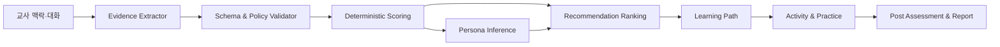

# 04. AI 역량진단·페르소나·추천 설계

문서 ID: AI-DIAG-004  
안전 원칙: 교육 지원 도구이며 의료·심리 진단과 인사평가에 사용하지 않는다.

정량 gate와 페르소나 계층의 normative source는 [design-baseline.json](design-baseline.json)이다. 진단 점수와 추천 순위의 유일한 실행 규범은 [15절의 결정적 정책](15-normative-policy-and-interface-contracts.md#5-결정적-진단페르소나추천-정책)이며, 구현 예제는 [진단·페르소나·추천 golden vectors](diagnosis-scoring-golden-vectors.json)를 byte-for-byte 통과해야 한다. 이 문서는 별도 계산식이나 가중치를 정의하지 않는다.

역량 지표·4수준 행동 anchor·질문은행·feature dictionary의 실행 기준은 [rubric-question-contract.json](rubric-question-contract.json), 12개 profile의 계수·정규화·missingness·calibration 기준은 [persona-inference-policy.json](persona-inference-policy.json)이다. 두 artifact는 fresh pilot calibration evidence가 없으면 `NON_PRODUCTION_REQUIRES_PILOT_CALIBRATION`/`NOT_READY`이며, 문서 서술이나 모델 출력으로 이 상태를 승격할 수 없다.

## 1. 모듈 경계



LLM은 발화의 의미, 근거 구간, 후보 역량, 추가 질문 후보를 구조화한다. 점수 산정, 수준 판정, 추천 hard filter, 통계 집계는 versioned rule과 코드로 결정한다.

## 2. 역량체계

| 코드 | 역량 | 관찰 항목 예시 |
|---|---|---|
| COMP-01 | 누리과정·보육과정 실행 | 목표-놀이-평가 연계, 유연한 계획 |
| COMP-02 | 영유아 발달 이해 | 발달차 존중, 관찰 기반 지원 |
| COMP-03 | 교사-영유아 상호작용 | 민감성, 질문, 갈등 중재, 포용 |
| COMP-04 | 관찰·기록·평가 | 객관적 기록, 해석 구분, 환류 |
| COMP-05 | 가정·지역사회 연계 | 보호자 소통, 자원 연계, 개인정보 |
| COMP-06 | 안전·권리·윤리 | 안전, 아동권리, 신고·윤리 경계 |
| COMP-07 | 전문성·학습운영 | 성찰, 협업, 디지털 활용, 지속학습 |

각 역량은 4수준 rubric을 가진다: `L1 기초 인식`, `L2 부분 적용`, `L3 일관 적용`, `L4 상황 확장`. RubricVersion에는 행동 anchor, 반례, 최소 evidence 수, confidence 규칙, 전문가 승인자가 포함된다.

## 3. 대화진단 상태기계

```text
CREATED → CONSENTED → CONTEXT_CAPTURE → ACTIVE
ACTIVE → PAUSED → ACTIVE
ACTIVE → EVIDENCE_REVIEW → SCORED → PERSONA_REVIEW
PERSONA_REVIEW → RECOMMENDED → COMPLETED
어느 상태에서든 사용자는 WITHDRAWN 가능
오류는 RECOVERABLE_ERROR 또는 TERMINATED로 분리
```

### 3.1 질문 정책

1. 안전·동의와 최소 맥락을 먼저 확인한다.
2. 질문별 목표 역량과 예상 information gain을 기록한다.
3. 미충족 역량, 낮은 confidence, 상충 evidence를 우선한다.
4. 자유응답, 상황선택, 성찰 질문을 섞되 한 질문에 한 판단만 요구한다.
5. 동일 의미 반복, 유도 질문, 감정 압박, 민감정보 요구를 금지한다.
6. 최대 18개 핵심 질문 또는 25분을 기본 한도로 하고 교사가 중단·재개할 수 있다.
7. 심각한 위해·학대 신호는 점수에 사용하지 않고 승인된 안전 안내와 사람 지원 경로로 전환한다.

### 3.2 Evidence schema

```json
{
  "evidence_id": "00000000-0000-4000-8000-000000000001",
  "turn_id": "uuid",
  "turn_sequence": 1,
  "indicator_id": "COMP-04-I02",
  "anchor": 3,
  "anchor_count": 5,
  "confidence_decimal": "0.800000",
  "span_start_codepoint": 0,
  "span_end_codepoint": 2,
  "quoted_span": "개인정보를 제거한 최소 발화 구간",
  "context_factors": ["returning_from_leave"],
  "needs_clarification": false,
  "schema_version": "evidence.v1"
}
```

`quoted_span`은 원문 전체 복제가 아니라 판단에 필요한 최소 NFC 구간이며 `span_start_codepoint`/`span_end_codepoint`는 NFC Unicode code point 기준 0-based half-open 범위다. `anchor`는 `0..anchor_count-1`, confidence는 정확한 fixed-six string이다. UUID는 lowercase canonical text다. 교사는 결과 화면에서 근거를 포함·제외·정정할 수 있지만 수정은 새 immutable evidence version을 만든다.

## 4. 결정적 scoring

구현은 오직 `ScoringPolicyVersion=diagnosis-scoring.v1`을 사용한다. `[0,1]` 값을 임의 부동소수로 계산하거나 stance/strength 기반 별도 공식을 만들지 않는다. fixed-six 입력, `SCALE=1_000_000`, arbitrary-precision integer와 `div_half_up`을 사용하고 evidence dedup·정렬·불충분 판정·다음 질문 tie-break는 15절 순서를 그대로 따른다. [golden vector](diagnosis-scoring-golden-vectors.json)의 정상·dedup·invalid case를 모든 runtime에서 동일하게 재현한다.

- 동일 EvidenceSet, RubricVersion, ScoringPolicyVersion은 항상 같은 결과를 낸다.
- confidence가 0.60 미만이면 확정 level 대신 `추가 확인 필요`로 표시한다.
- 상충 evidence가 임계치를 넘으면 추가 질문 또는 전문가 검토로 보낸다.
- 전체 점수는 역량별 점수를 숨기는 단일 순위값으로 사용하지 않는다.
- 재산정은 이전 snapshot을 덮어쓰지 않고 새 DiagnosisResultVersion을 만든다.

### 4.1 `DiagnosisDecisionPolicyVersion=diagnosis-decision.v1`

점수·level·confidence·상충·근거충족·다음 질문의 실행 가능한 기준은 [diagnosis-scoring-golden-vectors.json](diagnosis-scoring-golden-vectors.json)의 `decision_contract`와 `decision_vectors`다. 점수 범위는 integer micro-unit `0..100_000_000`이며 경계는 다음과 같이 양 끝을 포함한다.

| Level | 최소 | 최대 |
|---|---:|---:|
| L1 | 0 | 24,999,999 |
| L2 | 25,000,000 | 49,999,999 |
| L3 | 50,000,000 | 74,999,999 |
| L4 | 75,000,000 | 100,000,000 |

dimension confidence는 `div_half_up(Σ(indicator_weight_u × confidence_u), Σindicator_weight_u)`, overall confidence는 `div_half_up(Σ(dimension_weight_u × dimension_confidence_u), Σdimension_weight_u)`로 계산한다. confidence가 정확히 `600_000` 이상이어야 level을 부여할 수 있고 `599_999` 이하는 `ADDITIONAL_CONFIRMATION_REQUIRED`다.

동일 indicator의 서로 다른 turn에서 선택된 confidence `>=600_000` evidence 쌍마다 `div_half_up(SCALE × abs(anchor_a-anchor_b), anchor_count-1)`을 계산하고 최댓값을 `conflict_microunit`로 한다. `500_000` 이상이면 `HUMAN_REVIEW_REQUIRED`, `499_999` 이하는 상충 때문에 level을 막지 않는다. 서로 다른 `turn_sequence`에서 confidence `>=600_000`인 유효 evidence가 두 개 이상이어야 required indicator가 충족된다. required indicator 하나라도 미충족이면 `INSUFFICIENT_EVIDENCE`다.

판정 우선순위는 `INVALID_EVIDENCE → INSUFFICIENT_EVIDENCE → HUMAN_REVIEW_REQUIRED → ADDITIONAL_CONFIRMATION_REQUIRED → LEVEL_ASSIGNED`다. 점수가 `0..100_000_000` 밖이거나 confidence/conflict가 `0..1_000_000` 밖이고, numeric 입력이 boolean/non-integer이거나 `required_indicators_satisfied`가 boolean이 아니면 다른 부족·상충·저신뢰 조건보다 먼저 `INVALID_EVIDENCE`다. golden vector는 L1 최소·L4 최대, 상·하 범위 초과, 그리고 invalid와 부족·상충·저신뢰가 동시에 존재하는 precedence case를 각각 포함한다. 다음 질문은 `required_indicator_satisfied=false`만 대상으로 `coverage_count` 오름차순, rubric priority 오름차순, `question_id` NFC UTF-8 bytewise 오름차순으로 정확히 하나를 고른다. 이 순서·경계값을 변경하려면 새 policy version과 모든 boundary golden vector 승인이 필요하다.

## 5. 대표 교사 페르소나

페르소나는 교사를 고정 분류하는 신분값이 아니라 질문·설명·추천 맥락을 조정하는 확률분포다.

| Family ID | 대표 family | Versioned operational profiles | 지원 방식 |
|---|---|---|---|
| P-01 | 의욕적인 초임 실행가 | P-01-A 기초 루틴 구축형; P-01-B 멘토 동행 적용형 | 짧은 기초+즉시 적용, mentor 사례 |
| P-02 | 신중한 적응형 교사 | P-02-A 예시 확인 우선형; P-02-B 작은 단계 확신형 | 작은 단계, 예시·체크리스트, 확신 강요 금지 |
| P-03 | 휴직 후 복귀 재정비형 | P-03-A 제도 변화 재정렬형; P-03-B 디지털 도구 재진입형 | 변화 요약, 복귀 경로, 기존 전문성 인정 |
| P-04 | 숙련 실천 개선가 | P-04-A 고급 사례 탐구형; P-04-B 동료 코칭 확장형 | 심화 사례, peer coaching, 성찰·연구 |
| P-05 | 업무과부하 지원 필요형 | P-05-A 시간제약 핵심형; P-05-B 사람지원 연계형 | 저부담 경로, 우선순위, 사람 지원 안내 |
| P-06 | 지역·소규모 자원제약형 | P-06-A 저대역폭 비동기형; P-06-B 지역자원 연계형 | 비동기·저대역폭, 지역 자원, 대안 자료 |

`P-05`는 질환이나 번아웃을 진단하지 않는다. 지역·연차·기관 규모는 단독으로 역량 점수를 낮추지 않는다.

### 5.1 추론·수정

- 입력 feature: 명시적 프로필, 대화 evidence, 학습 제약, 선호; 보호속성의 부당한 proxy는 제외한다.
- 출력: 고정 순서 P-01-A~P-06-B의 12개 `profile_id` probability와 각 두 profile을 합산한 6개 family probability, 상위 3개 profile, supporting factors, contradicting factors, version.
- 두 분포의 합계는 각각 1이며 최대 family probability가 0.45 미만이면 `혼합/미확정`으로 표시한다.
- 사용자는 `맞음`, `일부 다름`, `사용하지 않음`을 선택하고 맥락을 수정할 수 있다.
- 수정은 점수를 직접 바꾸지 않고 질문정책과 추천 context를 재계산한다.

## 6. 추천 엔진

### 6.1 후보 생성과 hard filter

연수·자료는 역량, 수준, 소요시간, 형식, 선행조건, 접근성, 지역·온라인 제공, 권리, 게시상태를 가진다. 게시되지 않았거나 권한이 없고, 선행조건을 충족하지 못하며, 시간·접근성 제약과 충돌하는 항목은 ranking 전에 제거한다.

### 6.2 규범 순위 정책

구현은 오직 `RecommendationPolicyVersion=recommendation-ranking.v1`의 hard filter, fixed-point feature 가중치, novelty 계산과 greedy tie-break를 사용한다. 가중치나 penalty를 이 문서에서 재정의하지 않으며, policy artifact hash가 다른 결과는 비교·재현 가능한 새 version으로만 배포한다. 행동 로그만으로 중요 교육 내용을 숨기는 협업필터링은 사용하지 않는다.

### 6.3 설명

추천 카드에는 `보완할 역량`, `추천 사유`, `난이도`, `소요시간`, `기대 결과`, `사용한 맥락`, `대안`, `추천하지 않기`를 표시한다. 설명은 ranking feature에서 결정적으로 생성하고 LLM은 읽기 쉬운 표현으로만 변환한다.

## 7. 학습경로·성과 연계

학습경로는 DAG로 표현한다.

- 기초: 개념·안전·핵심 사례
- 심화: 비교 사례·판단·협업
- 적용: 현장 실천과제·관찰·성찰
- 확인: 사후 질문·evidence·교사 자기평가

Step은 선행조건, 선택/필수, 예상시간, 완료규칙, 대체항목을 가진다. 결과 리포트는 사전·사후의 동일 RubricVersion 비교를 우선하며, version이 다르면 변환 규칙과 한계를 표시한다. 기관 보고는 승인된 최소 인원 미만의 집단을 숨기고 개인 순위를 제공하지 않는다.

## 8. 평가와 공정성

| 평가 | 기준 |
|---|---|
| evidence 추출 | span precision/recall, 구조화 출력 성공률 ≥99.8% |
| 진단 | 전문가 일치도 ≥0.85, test-retest 안정성 |
| 추천 | 전문가·교사 적합도 ≥90%, coverage·diversity |
| 페르소나 | calibration, 사용자의 수정률, 집단별 오차 차이 |
| 안전 | 의료·인사 판단 금지 위반 0건, 위해 대응 정확성 |
| 설명 | 추천 사유-실제 feature 일치율 100% |

성별, 연령대, 지역, 기관규모, 연차, 복귀 여부별 성능을 최소 표본 조건에서 비교한다. 통계적으로 의미 있는 격차가 승인 한도를 넘으면 해당 model/policy를 배포하지 않고 질문·dataset·rule을 교정한다.

## 9. 사람 개입과 이의제기

- 교사는 evidence와 프로필을 수정하고 결과 재산정을 요청할 수 있다.
- 전문가 검토자는 가명화된 evidence, rubric, 모델·프롬프트 버전만 확인한다.
- 고위험·상충·저신뢰 결과는 자동 확정하지 않는다.
- 모든 수정은 원본, 변경자, 사유, 전후 결과를 감사 기록으로 남긴다.
- 진단·추천 결과는 교육 지원 외 목적으로 export할 수 없고 기관 관리자가 개인 결과를 임의 열람할 수 없다.

## 10. 시범운영 설계

200명의 교사를 2회 운영한다. 1차는 질문 이해도·진단 일치·추천 적합·이탈 원인을 수집하고 전문가 FGI로 루브릭·페르소나·문구를 조정한다. 승인된 변경만 새 version으로 2차에 적용하며 같은 핵심 지표로 비교한다. 개선요청은 `제기-분류-결정-구현-검증-반영` 상태로 추적하고 승인 개선 반영률 90% 이상을 확인한다.

## 11. 실행 가능한 상세 기준선

### 11.1 지표·anchor·질문은행

[rubric-question-contract.json](rubric-question-contract.json)은 7개 역량, 역량별 3개씩 총 21개 관찰 지표, 지표별 `L1..L4` 네 행동 anchor와 반례, 지표별 상황형·성찰형 2문항씩 총 42문항을 고정한다. 문항은 한 번에 한 판단만 요구하고 유도 문구와 민감속성 요구를 금지한다. 각 지표는 서로 다른 turn의 유효 evidence가 최소 2개 있어야 하며, LLM은 span·지표·anchor 후보만 구조화하고 결정적 scorer를 변경하지 않는다.

feature dictionary의 18개 입력은 사용자가 명시한 경력 band, 지역의 자원 가용 category, 승인된 현장경험 taxonomy, 관심 keyword ID, 제약·선호·지원 필요에 한정한다. 정확한 지역·기관명은 수집하지 않으며 지역 category는 추천 hard filter와 대체자원 제시에만 쓴다. 성별, 연령, 장애, 국적, 건강상태 같은 보호속성과 우편번호, 정확한 지역, 기관명, 이름 embedding, 추론된 심리상태 같은 proxy는 입력·추론 모두 금지한다. missing은 `false`로 해석하지 않고 `MISSING`과 누락 feature ID를 보존한다. 누락이 6개를 초과하면 `INSUFFICIENT_CONTEXT`이며, 이 feature는 진단 점수에 영향을 줄 수 없다.

현재 정서적 부담과 격려 선호는 사용자가 해당 session에 별도 opt-in한 자기보고만 허용한다. 두 field는 `RESTRICTED`, 최대 24시간 보존이며 응답 tone, 저부담 경로, 선택적 사람 지원 제안에만 사용한다. 임상·감정 추론, 역량 점수, 인사 판단은 금지하고 철회 시 즉시 삭제한 뒤 해당 field 없이 재계산한다.

### 11.2 12-profile 계산과 calibration

[persona-inference-policy.json](persona-inference-policy.json)은 P-01-A부터 P-06-B까지 고정 순서의 12개 profile × 18개 feature 계수 행렬을 integer micro-unit으로 정의한다. 구현은 arbitrary-precision integer, `div_half_up`, 양수 offset 정규화, 합계 잔차 배분과 UTF-8 bytewise tie-break를 그대로 사용해 profile과 family probability 합을 각각 정확히 `1_000_000`으로 만든다. 최대 family probability가 `450_000` 미만이면 혼합/미확정이다.

운영 활성화에는 subject-disjoint holdout 최소 600세션, profile별 최소 40세션, ECE `<=50_000`, Brier `<=180_000`, 95% confidence interval과 slice gap 검증이 필요하다. 현재 evidence state는 `MISSING`이므로 production 결과로 표현하거나 인사·의료 판단에 사용할 수 없다.

### 11.3 raw-dialogue E2E gate

[evaluation-policy-contract.json](evaluation-policy-contract.json)의 `EVAL-DIAG-RAW-E2E`는 개인정보 최소화 전 원 대화에서 NFC span 추출, 지표/anchor mapping, 결정적 점수와 최종 판정까지 하나의 lineage로 검증한다. 최소 300개의 subject-disjoint session, 독립 평가자 2명과 제3자 adjudication, span F1 `>=0.90`, weighted expert agreement `>=0.85`, structured output `>=0.998`, train/holdout leakage `=0`을 모두 만족해야 한다. point estimate만 있거나 confidence interval·slice·adjudication이 없으면 `PASS`가 아니라 `INSUFFICIENT_DATA`다.
