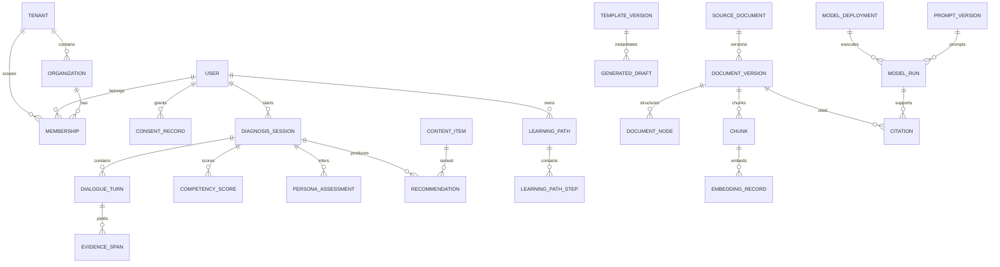

# 07. 데이터·API·인터페이스 설계

문서 ID: DATA-ICD-007  
계약 기준: REST `/api/v1`, OpenAPI 3.1, JSON Schema, UTC, UUID

tenant key, 동의·권리 epoch, deterministic policy와 DocumentGraph의 normative contract는 [규범 정책·인터페이스 계약](15-normative-policy-and-interface-contracts.md)이다. 화면별 exact method/path·guard·event·state는 [screen-route-contracts.json](screen-route-contracts.json), 요구·시험 edge는 [requirements-test-registry.json](requirements-test-registry.json)이 machine-readable source다.

## 1. 데이터 원칙

- 모든 시간은 timezone-aware UTC로 저장하고 화면에서 사용자 timezone으로 변환한다.
- global business entity는 single `PRIMARY KEY (id)` UUID를 사용한다. tenant-scoped entity의 `id`도 UUID지만 key는 `PRIMARY KEY (tenant_id, id)`다. tenant parent를 참조하는 FK는 `(tenant_id, parent_id)` composite이고 global parent는 `parent_id`만 참조하며, `Tenant` 참조는 이미 존재하는 `tenant_id`를 중복 column 없이 사용한다. 두 유형 모두 `created_at`, `updated_at`, `row_version`을 가진다.
- 코드값은 영문 stable code와 한국어 label을 분리한다.
- published rubric, prompt, template, document artifact, report snapshot은 불변이다.
- 개인정보 삭제와 법정 감사보존이 충돌하면 본문을 파기하고 최소 tombstone을 보존한다.
- 임의 JSON은 versioned schema와 validator가 있을 때만 사용한다.
- tenant-scoped table은 `tenant_id NOT NULL`, tenant를 포함한 PK·unique·FK와 `FORCE ROW LEVEL SECURITY`를 요구한다. RLS가 없는 datastore는 tenant key를 partition/key와 authorization에 결합한 동등한 자동 부정 시험을 요구하며 application predicate만으로 대체할 수 없다.
- object/cache/queue/vector/event도 tenant namespace를 가지며 ANN post-filter-only 구현을 금지한다.
- `Tenant`는 보안·데이터 격리 단위이고 `Organization`은 업무 조직이다. 조직은 정확히 하나의 tenant에 속하지만 하나의 tenant는 여러 조직을 가질 수 있다. tenant 없는 공개 자료는 승인된 `ContentItem`에서 생성한 read-only public allowlist projection으로만 노출하며 tenant table의 nullable tenant나 별도 쓰기 가능한 공개 원장으로 표현하지 않는다.

### 1.1 Machine-readable entity catalog

[entity-catalog.json](entity-catalog.json)은 요구사항 레지스트리에 등장하는 정확한 58개 `data_entity_ids`의 canonical catalog다. 각 행은 `entity_id`, domain, `PUBLIC|INTERNAL|CONFIDENTIAL|RESTRICTED` 분류, `GLOBAL|TENANT` scope, retention policy, owner, schema ID, 삭제 정책과 reverse `requirement_ids`를 가진다. catalog와 요구사항의 entity 집합·역방향 요구사항·owner 합집합이 다르면 설계 gate를 실패한다. 알 수 없는 entity/classification은 등록 시까지 `RESTRICTED`로 처리하며 API·DB·object·queue·vector 저장소가 catalog보다 약한 분류나 보존정책을 적용할 수 없다.

[persistent-domain-catalog.json](persistent-domain-catalog.json)은 구현 DDL·migration 관점의 확장 catalog다. 요구 추적용 58개 집합을 전부 포함하면서 Tenant/Organization/Membership, 인증 session·MFA, `DataProcessingRegistry`, `SafeguardingCase`, 문서·RAG 파생물, 모델·평가, 삭제·복구·보안·handover 증거를 포함한 102개 persistent entity에 PK, FK, index, cardinality, RLS, classification floor/상속, retention과 deletion policy를 고정한다. migration은 두 catalog 모두와 일치해야 한다.

## 2. 핵심 엔터티

### 2.1 Identity·거버넌스

| 엔터티 | 주요 필드·관계 | 삭제·보존 |
|---|---|---|
| User | email unique, status, name, locale | 탈퇴 시 식별자 가명화 |
| PasswordCredential | User 1:1 FK, Argon2id hash/algorithm, password_changed_at, failure/lock state; secret field log 금지 | User와 분리된 credential boundary, rotate 또는 crypto erase |
| Tenant | id, stable code, status, `acl_version`, isolation policy | 참조 존재 시 비활성화; 재사용 금지 |
| Organization | `tenant_id`, type, region_category, status; tenant 1:N organization | 참조 존재 시 비활성화 |
| Membership | `tenant_id`, user↔organization, role, valid period, membership version | 기간 이력 보존 |
| Role/Permission | stable code, policy version | 사용 중 삭제 금지 |
| ConsentRecord | tenant, subject, purpose, version, `consent_epoch`, granted/withdrawn_at | 법적 증적 기간 보존 |
| TeacherContext | career band, interests, constraints | 선택정보, 철회 시 파기 |

### 2.2 진단·추천·학습

| 엔터티 | 주요 필드·관계 |
|---|---|
| CompetencyFramework/Dimension | framework 1:N dimension, version/state |
| RubricVersion | typed indicator/anchor/question value object, 개별 catalog digest와 전체 artifact digest, semantic version; ACTIVE 이후 immutable |
| DiagnosisSession | user, framework, state, consent snapshot |
| DialogueTurn | session, sequence unique, actor, content ref |
| EvidenceSpan | `(tenant_id,evidence_id)`, turn ID+sequence, indicator ID, ordinal anchor+anchor count, fixed-six confidence, NFC code-point half-open span, quoted minimum span, schema/policy version |
| DiagnosisResult/CompetencyScore | session, rubric/scoring version, score, confidence, evidence coverage, conflict/최종 decision |
| PersonaDefinition/Assessment | immutable feature coefficient catalog/hash와 artifact digest, versioned persona, session probabilities, correction |
| Course/ContentItem | competency tags, level, duration, prerequisite, accessibility, region availability, rights, publication |
| Recommendation | result, item, policy version, rank, reason features |
| LearningPath/Step | user, recommendation, ordered DAG, completion rule; `LearningPathStepDependency` association table의 predecessor/successor composite FK와 deferred cycle rejection |
| Enrollment/LearningActivity | path/item, progress, occurred_at |
| PracticeTask | step, submission ref, review state |
| ReportSnapshot | subject/scope, period, fact version, immutable artifact |

### 2.3 Document AI·RAG

| 엔터티 | 주요 필드·관계 |
|---|---|
| SourceDocument/DocumentVersion | tenant, logical document 1:N immutable source version, rights, `acl_version` |
| FileObject | object key, checksum, MIME, size, encryption, scan state |
| ProcessingJob/Artifact | stage, attempt, input/output checksum, tool version |
| DocumentNode/TableCell | `DocumentGraphSchemaVersion`, tree node, versioned source locator, style_ref, structure confidence, topology |
| Chunk | document version, node set, ACL, text hash |
| EmbeddingRecord/IndexSnapshot | chunk, model version, vector, active alias |
| Citation | tenant-scoped Claim FK, document version, node/cell locator, quoted span, entailment, current-rights decision |
| DraftTemplate/TemplateVersion | type, schema, style, approval |
| GeneratedDraft | template, evidence set, state, artifact, review |
| ReviewDecision | target type/id, reviewer, decision, reason |

### 2.4 AI·운영

| 엔터티 | 주요 필드·관계 |
|---|---|
| ModelProvider/ModelDeployment | capability, endpoint ref, data class, status |
| RoutingPolicy | task, conditions, primary/fallback, version |
| PromptVersion/SchemaVersion | content hash, contract, approval |
| ModelRun | task, versions, usage, latency, safety; 원문 최소화 |
| EvaluationSuite/Run | dataset, slice, metrics, thresholds, decision |
| PilotCohort/Feedback | round, participant pseudonym, survey/FGI issue |
| Notification/Inquiry | channel, recipient, state, retention |
| AuditEvent | actor, action, target, before/after hash, immutable |
| OutboxEvent | aggregate, type, payload schema, delivery state |
| FeatureFlag | scope, owner, effective period, audit |

## 3. 핵심 ERD



## 4. Transaction boundary

모든 tenant API transaction은 인증 middleware가 current membership을 확인한 뒤 시작한다. transaction의 첫 DB statement는 parameterized `SET LOCAL app.tenant_id = :validated_tenant_id`이며 곧바로 `current_setting('app.tenant_id', true)` equality를 확인한다. transaction pool 반환 전 `SET LOCAL`은 자동 소멸해야 한다. tenant context 누락·불일치·membership version stale은 domain query 전에 rollback하고 감사한다. background job은 signed event의 tenant와 current membership/service grant를 다시 확인해 같은 절차를 사용한다.

- 진단 턴: Turn+Evidence+Score+Session state+Outbox를 한 transaction으로 저장한다.
- 추천 생성: Result snapshot과 policy를 잠그고 Recommendation set을 원자적으로 교체한다.
- 문서 게시: 승인 artifact+index snapshot 준비 후 active alias와 publication state를 원자 전환한다.
- 동의 철회: ConsentRecord와 증가한 `consent_epoch`를 먼저 같은 transaction에서 확정하고 비동기 파기 event를 outbox에 기록한다. commit 직후 신규 읽기·AI 사용을 deny한다.
- ACL·게시·license 철회: canonical 권리와 증가한 `acl_version`을 먼저 commit하여 즉시 deny한 뒤 purge/reindex event를 기록한다.
- 파일 업로드와 외부 메일은 DB transaction에 포함하지 않고 signed operation/outbox로 보상한다.

## 5. REST API

### 5.1 공통

- base: `/api/v1`
- auth: short-lived bearer access token; refresh는 secure HttpOnly cookie
- tenant: tenant-scoped access token은 `active_tenant_id`, `membership_id`, `membership_version`, role/policy version을 포함한다. `POST /tenants/{tenant_id}/activate`는 current membership을 검증하고 새 access token을 발급하며 기존 token의 tenant claim을 수정하지 않는다. route/header/query로 임의 tenant를 덮어쓰지 않는다.
- public: 공개 endpoint는 tenant token을 요구하지 않고 immutable `PublicRegistryEntry` projection만 읽는다. 공개 자료가 tenant-owned 원본을 가리키면 publication grant와 current rights를 거친 opaque public ID만 사용한다.
- mutation: `Idempotency-Key`와 `If-Match` row version 지원
- pagination: `page[cursor]`, `page[size]≤100`, stable sort
- 오류: `application/problem+json`
- 정책 결과: policy alias와 immutable semantic version/hash를 반환하며 `PersonaInferencePolicyVersion`, `RecommendationPolicyVersion` 등 필수 ID 누락·불일치는 `POLICY_VERSION_MISMATCH`다.

```json
{
  "type": "https://yonlab.example/problems/validation",
  "title": "입력값을 확인해 주세요",
  "status": 422,
  "code": "VALIDATION_FAILED",
  "trace_id": "uuid",
  "errors": [{"field":"career_band","reason":"INVALID_ENUM"}]
}
```

### 5.2 endpoint 목록

| 영역 | Endpoint |
|---|---|
| Public | `GET /portal/home`, `/public/search`, `/public/catalog`, `/public/resources/{resource_id}` |
| Auth | `POST /auth/register`, `/auth/login`, `/auth/refresh`, `/auth/logout`, `/auth/password-resets`; MFA enrollment/challenge/verify/recovery/recovery-code rotation |
| Tenant | `GET /tenants`, `POST /tenants/{tenant_id}/activate`; current membership과 token 재발급 |
| Me | `GET/PATCH /me`, `GET/POST /me/consents`, `GET /me/dashboard`, `/me/activity`, `/me/notifications`, `POST /me/export-requests`, `/me/deletion-requests`, `/inquiries` |
| Diagnosis | `POST /diagnoses`, `GET /diagnoses/{id}`, `POST /diagnoses/{id}/turns`, `/pause`, `/resume`, `/complete` |
| Evidence | `GET /diagnoses/{id}/evidence`, `PATCH /evidence/{id}`, `POST /diagnoses/{id}/rescore` |
| Result | `GET /diagnoses/{id}/results`, `/personas`, `PATCH /diagnoses/{id}/persona-context` |
| Recommendation | `GET /recommendations`, `POST /recommendations/{id}/feedback`, `POST /learning-paths` |
| Learning | `GET /learning-paths/{id}`, `POST /steps/{id}/start`, `/complete`, `/practice-submissions` |
| Report | `POST /reports`, `GET /reports/{id}`, `/reports/{id}/artifact` |
| Search/RAG | `POST /search`, `POST /rag/sessions`, `POST /rag/sessions/{id}/messages`, `GET /citations/{id}` |
| Documents | `POST /documents/uploads`, `POST /documents`, `GET /documents/{id}`, `/versions/{id}/preview` |
| Drafts | `GET /draft-templates`, `POST /drafts`, `PATCH /drafts/{id}`, `POST /drafts/{id}/review`, `/export` |
| Admin policy/content | `/admin/frameworks`, `/rubrics`, `/personas`, `/catalog`, `/recommendation-policies`, `/document-publications`, `/draft-templates`, `/prompts`, `/schemas`, `/routing-policies`, `/models`, `/evaluations`, `/evaluation-datasets` |
| Admin identity/pilot | `/admin/users`, `/organizations`, `/memberships`, `/roles`, `/consents`, `/pilot-cohorts`, `/fgi-sessions`, `/improvement-issues` |
| Admin analytics/audit | `/admin/analytics/outcomes`, `/analytics/course-effects`, `/reports`, `/audit-events`, `/audit-exports`, `/security-events` |
| Operations | `GET /health/live`, `/health/ready`, `/health`, `/ready`, `/jobs/{id}`, `/admin/jobs`, `/admin/indexes`, `/admin/storage`, `/admin/backups`, `/admin/integrations`, `/admin/metrics-summary`, `/admin/ai-runs`, `/admin/ai-costs`, `/admin/ai-fallbacks` |

진단·RAG 스트리밍은 SSE를 사용하고 최종 구조화 결과는 REST resource로 조회한다. SSE event는 `message.delta`, `message.completed`, `job.progress`, `error`, `heartbeat`이며 `Last-Event-ID` 재연결을 지원한다.

위 표는 endpoint family index다. [platform-openapi.json](platform-openapi.json)은 **merged deployed implementation contract**다. [screen-route-contracts.json](screen-route-contracts.json)의 screen-scoped 113개 `api_operations`와 [legacy-reuse-decision-matrix.json](legacy-reuse-decision-matrix.json)의 service-auth 4개를 합친 117개 method/path, 61개 write request blueprint, 117개 response blueprint를 exact하게 고정한다. 모든 write request body는 `required=true`이고 모든 path placeholder는 같은 이름의 required path parameter를 가지며, query/header/cookie parameter까지 semantic digest에 포함한다. request/response fallback과 GET request body는 허용하지 않는다. [platform-asyncapi.json](platform-asyncapi.json)은 diagnosis/RAG/job SSE의 `Last-Event-ID` 재연결과 current authorization 재검사를 고정한다.

deployed OpenAPI의 인증 operation set은 [legacy-reuse-decision-matrix.json](legacy-reuse-decision-matrix.json)의 `authentication_api_union_contract`를 따른다. 즉 screen-scoped 인증 9개와 service-only `POST /api/v1/auth/refresh`, `/auth/logout`, `/auth/logout-all`, `/auth/password-resets/confirm` 4개의 합집합 13개와 정확히 같다. 각 service-only operation은 field code뿐 아니라 wire name, BODY/HEADER/COOKIE 위치, required 여부, exact JSON Schema, success status, error vocabulary, security scheme, owner, requirement, test, DataUse, rotation/replay state transition을 함께 고정한다. reset token과 새 비밀번호는 URL/path가 아니라 request body에만 존재하고 log 정책은 `NEVER`다. `T-API-001`과 `T-SEC-005`는 누락·중복·unknown field와 status/error/security/state drift를 거부한다. 화면 contract에 있는데 OpenAPI에 없거나 합집합의 service-only operation이 배포 계약에 없으면 `GATE-DESIGN-INTEGRITY`, `GATE-CODE-QUALITY`, `GATE-SECURITY-PRIVACY`가 실패한다.

### 5.3 MFA·재인증 계약

- 등록: `POST /auth/mfa/enrollments`는 password 재인증 후 short-lived enrollment transaction과 secret을 반환하고, verify 성공 전 credential을 활성화하지 않는다.
- challenge: `POST /auth/mfa/challenges`와 `POST /auth/mfa/challenges/{challenge_id}/verify`는 nonce·actor·tenant·purpose·expiry·attempt limit에 묶인다.
- 복구: `POST /auth/mfa/recovery`는 generic response, rate limit, 별도 알림과 session family revoke를 적용한다. recovery code rotation은 MFA+15분 이내 재인증이 필요하다.
- 고권한: `ACTIVE_TENANT_ROLE_MFA_REAUTH` guard는 current tenant membership, required role, MFA assurance와 15분 이내 reauth를 모두 요구한다. 실패 시 resource 존재를 노출하지 않는다.

### 5.4 내부 AI·권리 계약

API와 worker는 mTLS workload identity로 별도 AI Gateway의 canonical internal API만 호출하고 매 generation·embedding·rerank·repair에 signed `DataUseContext`를 보낸다. Gateway는 `consent_epoch`와 current `acl_version`을 매번 동기 재승인하며 timeout·stale·unknown은 거부한다. citation은 immutable document version/locator/source hash를 저장하되 반환·dereference 때 current membership·ACL·publication·license·retention을 다시 확인한다. index rollback은 이 current-rights 판정을 과거로 되돌릴 수 없다.

## 6. 비동기 Job 계약

장기 작업은 `202 Accepted`와 다음 resource를 반환한다.

```json
{
  "job_id":"uuid",
  "type":"document.process",
  "state":"QUEUED",
  "progress":0,
  "links":{"self":"/api/v1/jobs/uuid","cancel":"/api/v1/jobs/uuid/cancel"}
}
```

상태는 `QUEUED, RUNNING, REVIEW_REQUIRED, SUCCEEDED, FAILED, CANCELLED`다. 재시도 가능한 오류와 사용자 수정 필요 오류를 분리하고 artifact가 생성된 뒤에만 성공 처리한다.

## 7. Event 계약

| Event | Producer | Consumer |
|---|---|---|
| `diagnosis.completed.v1` | Diagnosis | Recommendation, Reporting |
| `recommendation.accepted.v1` | Recommendation | Learning Path |
| `learning.activity.recorded.v1` | Learning | Reporting |
| `document.version.accepted.v1` | Document | Processing Worker |
| `document.index.published.v1` | Retrieval | Cache, Audit |
| `draft.reviewed.v1` | Draft | Export, Notification |
| `consent.withdrawn.v1` | Identity | Purge workers, AI policy |
| `source-rights.changed.v1` | Document/Identity | Retrieval deny cache, purge/reindex, Audit |
| `model.evaluation.failed.v1` | Evaluation | Deployment gate, Alert |

Envelope은 `event_id`, `event_type`, `occurred_at`, `producer`, `tenant_id`, `aggregate_id`, `schema_version`, `trace_id`, `payload`를 포함한다. consumer는 event_id로 중복을 제거한다.

## 8. 외부 Adapter

- PortalAdapter: 사용자·콘텐츠 deep link, SSO/OIDC, 공개 metadata 동기화
- LearningAdapter: 과정·이수 결과 import/export
- StorageAdapter: put/get/delete, signed URL, lifecycle, checksum
- EmailAdapter: template ID, recipient, delivery status, provider message ID
- AIProviderAdapter: structured response, stream, embeddings, health
- HwpConverterAdapter: HWP↔HWPX/PDF 변환 job과 validation report

각 adapter는 sandbox contract test, timeout, idempotency, rate limit, error taxonomy를 제공한다. 외부 API 미확정 시 simulator로 전체 시스템 시험이 가능해야 한다.

## 9. Migration·보존

- Alembic forward migration과 production-sized rehearsal을 필수화한다.
- destructive schema change는 expand-migrate-contract 3단계를 사용한다.
- DB backup뿐 아니라 object manifest, model/prompt registry, index rebuild manifest를 함께 보존한다.
- 보존기간은 데이터 처리목적·법령·계약에 따라 RetentionPolicy로 설정하며 만료 job과 삭제 증적을 제공한다.

## 10. DocumentGraph·물리 파기

[DocumentGraph JSON Schema 2020-12](document-graph.schema.json)는 `DocumentGraphSchemaVersion=document-graph.v1`/`urn:yonlab:document-graph:1.0.0`으로 고정하고 closed node/HWPX/page/table locator, required field, deterministic UUIDv5, 0-based half-open character/table range, 1-based page와 integer micro-unit bounding box를 검증한다. HWP는 network가 차단된 sandbox에서 HWPX로 변환하고 converter digest·source/output hash·구조 count·손실 보고서를 남긴다. 손실 또는 locator 재현 실패는 `REVIEW_REQUIRED` 또는 `FAILED`이며 자동 게시하지 않는다.

raw/object, graph, chunk, embedding, cache, export와 backup manifest는 lineage·tenant·목적·등급·retention을 가진다. 삭제는 `DELETE_REQUESTED`에서 즉시 사용을 deny하고 DB/object/cache/vector/evaluation/export/provider receipt를 `PURGING`한 뒤 독립 대조가 끝나야 `VERIFIED`다. 복원 전 deletion ledger를 재적용하며 tombstone에는 content나 직접 식별자를 남기지 않는다.
