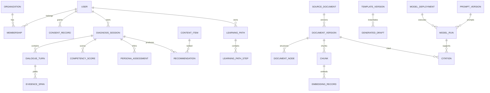

# 07. 데이터·API·인터페이스 설계

문서 ID: DATA-ICD-007  
계약 기준: REST `/api/v1`, OpenAPI 3.1, JSON Schema, UTC, UUID

## 1. 데이터 원칙

- 모든 시간은 timezone-aware UTC로 저장하고 화면에서 사용자 timezone으로 변환한다.
- business entity는 UUID PK, `created_at`, `updated_at`, `row_version`을 가진다.
- 코드값은 영문 stable code와 한국어 label을 분리한다.
- published rubric, prompt, template, document artifact, report snapshot은 불변이다.
- 개인정보 삭제와 법정 감사보존이 충돌하면 본문을 파기하고 최소 tombstone을 보존한다.
- 임의 JSON은 versioned schema와 validator가 있을 때만 사용한다.
- tenant/organization scope가 있는 table은 composite index와 DB row policy 검토 대상이다.

## 2. 핵심 엔터티

### 2.1 Identity·거버넌스

| 엔터티 | 주요 필드·관계 | 삭제·보존 |
|---|---|---|
| User | email unique, status, name, locale | 탈퇴 시 식별자 가명화 |
| Organization | type, region_category, status | 참조 존재 시 비활성화 |
| Membership | user↔organization, role, valid period | 기간 이력 보존 |
| Role/Permission | stable code, policy version | 사용 중 삭제 금지 |
| ConsentRecord | purpose, version, granted/withdrawn_at | 법적 증적 기간 보존 |
| TeacherContext | career band, interests, constraints | 선택정보, 철회 시 파기 |

### 2.2 진단·추천·학습

| 엔터티 | 주요 필드·관계 |
|---|---|
| CompetencyFramework/Dimension | framework 1:N dimension, version/state |
| RubricVersion | dimension, anchors, weights, effective_at |
| DiagnosisSession | user, framework, state, consent snapshot |
| DialogueTurn | session, sequence unique, actor, content ref |
| EvidenceSpan | turn, indicator, span, stance, confidence |
| DiagnosisResult/CompetencyScore | session, rubric/scoring version, score/confidence |
| PersonaDefinition/Assessment | versioned persona, session probabilities, correction |
| Course/ContentItem | competency tags, level, duration, rights, publication |
| Recommendation | result, item, policy version, rank, reason features |
| LearningPath/Step | user, recommendation, ordered DAG, completion rule |
| Enrollment/LearningActivity | path/item, progress, occurred_at |
| PracticeTask | step, submission ref, review state |
| ReportSnapshot | subject/scope, period, fact version, immutable artifact |

### 2.3 Document AI·RAG

| 엔터티 | 주요 필드·관계 |
|---|---|
| SourceDocument/DocumentVersion | logical document 1:N immutable source version |
| FileObject | object key, checksum, MIME, size, encryption, scan state |
| ProcessingJob/Artifact | stage, attempt, input/output checksum, tool version |
| DocumentNode/TableCell | tree node, source locator, topology, confidence |
| Chunk | document version, node set, ACL, text hash |
| EmbeddingRecord/IndexSnapshot | chunk, model version, vector, active alias |
| Citation | run/claim, document version, node/cell locator |
| DraftTemplate/TemplateVersion | type, schema, style, approval |
| GeneratedDraft | template, evidence set, state, artifact, review |
| ReviewDecision | target type/id, reviewer, decision, reason |

### 2.4 AI·운영

| 엔터티 | 주요 필드·관계 |
|---|---|
| ModelProvider/ModelDeployment | capability, endpoint ref, data class, status |
| RoutingPolicy | task, conditions, primary/fallback, version |
| PromptVersion/SchemaVersion | content hash, contract, approval |
| ModelRun | task, versions, usage, latency, safety; 원문 최소화 |
| EvaluationSuite/Run | dataset, slice, metrics, thresholds, decision |
| PilotCohort/Feedback | round, participant pseudonym, survey/FGI issue |
| Notification/Inquiry | channel, recipient, state, retention |
| AuditEvent | actor, action, target, before/after hash, immutable |
| OutboxEvent | aggregate, type, payload schema, delivery state |
| FeatureFlag | scope, owner, effective period, audit |

## 3. 핵심 ERD



## 4. Transaction boundary

- 진단 턴: Turn+Evidence+Score+Session state+Outbox를 한 transaction으로 저장한다.
- 추천 생성: Result snapshot과 policy를 잠그고 Recommendation set을 원자적으로 교체한다.
- 문서 게시: 승인 artifact+index snapshot 준비 후 active alias와 publication state를 원자 전환한다.
- 동의 철회: ConsentRecord를 먼저 확정하고 비동기 파기 event를 outbox에 기록한다.
- 파일 업로드와 외부 메일은 DB transaction에 포함하지 않고 signed operation/outbox로 보상한다.

## 5. REST API

### 5.1 공통

- base: `/api/v1`
- auth: short-lived bearer access token; refresh는 secure HttpOnly cookie
- mutation: `Idempotency-Key`와 `If-Match` row version 지원
- pagination: `page[cursor]`, `page[size]≤100`, stable sort
- 오류: `application/problem+json`

```json
{
  "type": "https://yonlab.example/problems/validation",
  "title": "입력값을 확인해 주세요",
  "status": 422,
  "code": "VALIDATION_FAILED",
  "trace_id": "uuid",
  "errors": [{"field":"career_band","reason":"INVALID_ENUM"}]
}
```

### 5.2 endpoint 목록

| 영역 | Endpoint |
|---|---|
| Auth | `POST /auth/register`, `/auth/login`, `/auth/refresh`, `/auth/logout`, `/auth/password-resets` |
| Me | `GET/PATCH /me`, `GET/POST /me/consents`, `POST /me/export-requests`, `/me/deletion-requests` |
| Diagnosis | `POST /diagnoses`, `GET /diagnoses/{id}`, `POST /diagnoses/{id}/turns`, `/pause`, `/resume`, `/complete` |
| Evidence | `GET /diagnoses/{id}/evidence`, `PATCH /evidence/{id}`, `POST /diagnoses/{id}/rescore` |
| Result | `GET /diagnoses/{id}/results`, `/personas`, `PATCH /diagnoses/{id}/persona-context` |
| Recommendation | `GET /recommendations`, `POST /recommendations/{id}/feedback`, `POST /learning-paths` |
| Learning | `GET /learning-paths/{id}`, `POST /steps/{id}/start`, `/complete`, `/practice-submissions` |
| Report | `POST /reports`, `GET /reports/{id}`, `/reports/{id}/artifact` |
| Search/RAG | `POST /search`, `POST /rag/sessions`, `POST /rag/sessions/{id}/messages` |
| Documents | `POST /documents/uploads`, `POST /documents`, `GET /documents/{id}`, `/versions/{id}/preview` |
| Drafts | `GET /draft-templates`, `POST /drafts`, `PATCH /drafts/{id}`, `POST /drafts/{id}/review`, `/export` |
| Admin | `/admin/frameworks`, `/rubrics`, `/personas`, `/catalog`, `/documents`, `/models`, `/evaluations` |
| Operations | `GET /health/live`, `/health/ready`, `/jobs/{id}`, `/admin/metrics-summary`, `/admin/audit-events` |

진단·RAG 스트리밍은 SSE를 사용하고 최종 구조화 결과는 REST resource로 조회한다. SSE event는 `message.delta`, `message.completed`, `job.progress`, `error`, `heartbeat`이며 `Last-Event-ID` 재연결을 지원한다.

## 6. 비동기 Job 계약

장기 작업은 `202 Accepted`와 다음 resource를 반환한다.

```json
{
  "job_id":"uuid",
  "type":"document.process",
  "state":"QUEUED",
  "progress":0,
  "links":{"self":"/api/v1/jobs/uuid","cancel":"/api/v1/jobs/uuid/cancel"}
}
```

상태는 `QUEUED, RUNNING, REVIEW_REQUIRED, SUCCEEDED, FAILED, CANCELLED`다. 재시도 가능한 오류와 사용자 수정 필요 오류를 분리하고 artifact가 생성된 뒤에만 성공 처리한다.

## 7. Event 계약

| Event | Producer | Consumer |
|---|---|---|
| `diagnosis.completed.v1` | Diagnosis | Recommendation, Reporting |
| `recommendation.accepted.v1` | Recommendation | Learning Path |
| `learning.activity.recorded.v1` | Learning | Reporting |
| `document.version.accepted.v1` | Document | Processing Worker |
| `document.index.published.v1` | Retrieval | Cache, Audit |
| `draft.reviewed.v1` | Draft | Export, Notification |
| `consent.withdrawn.v1` | Identity | Purge workers, AI policy |
| `model.evaluation.failed.v1` | Evaluation | Deployment gate, Alert |

Envelope은 `event_id`, `event_type`, `occurred_at`, `producer`, `tenant_id`, `aggregate_id`, `schema_version`, `trace_id`, `payload`를 포함한다. consumer는 event_id로 중복을 제거한다.

## 8. 외부 Adapter

- PortalAdapter: 사용자·콘텐츠 deep link, SSO/OIDC, 공개 metadata 동기화
- LearningAdapter: 과정·이수 결과 import/export
- StorageAdapter: put/get/delete, signed URL, lifecycle, checksum
- EmailAdapter: template ID, recipient, delivery status, provider message ID
- AIProviderAdapter: structured response, stream, embeddings, health
- HwpConverterAdapter: HWP↔HWPX/PDF 변환 job과 validation report

각 adapter는 sandbox contract test, timeout, idempotency, rate limit, error taxonomy를 제공한다. 외부 API 미확정 시 simulator로 전체 시스템 시험이 가능해야 한다.

## 9. Migration·보존

- Alembic forward migration과 production-sized rehearsal을 필수화한다.
- destructive schema change는 expand-migrate-contract 3단계를 사용한다.
- DB backup뿐 아니라 object manifest, model/prompt registry, index rebuild manifest를 함께 보존한다.
- 보존기간은 데이터 처리목적·법령·계약에 따라 RetentionPolicy로 설정하며 만료 job과 삭제 증적을 제공한다.

